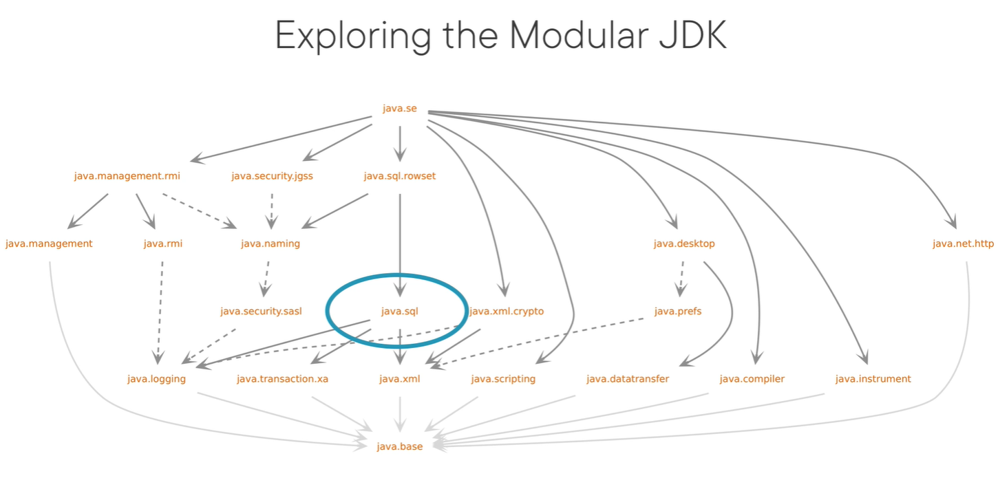
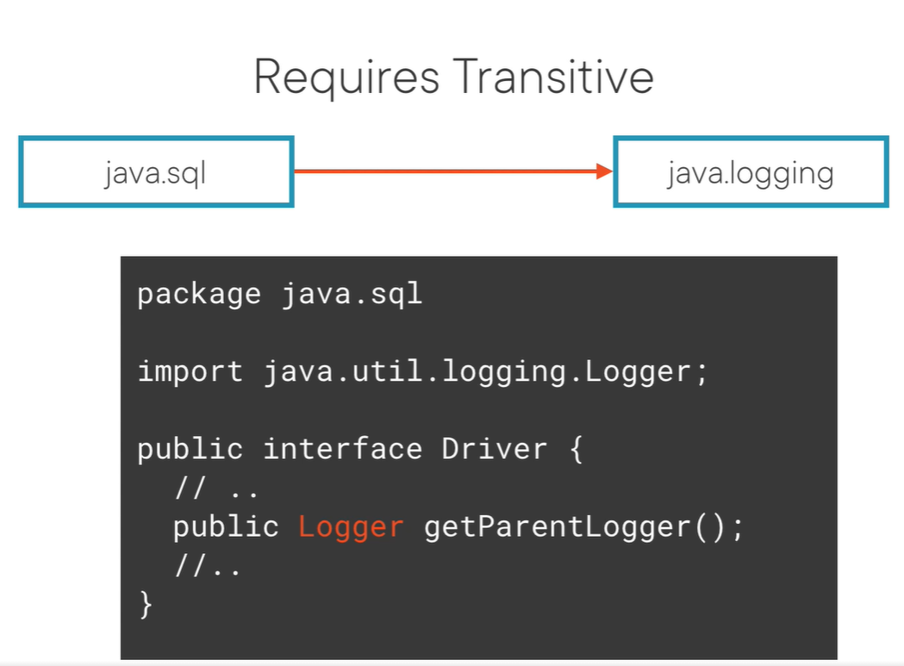
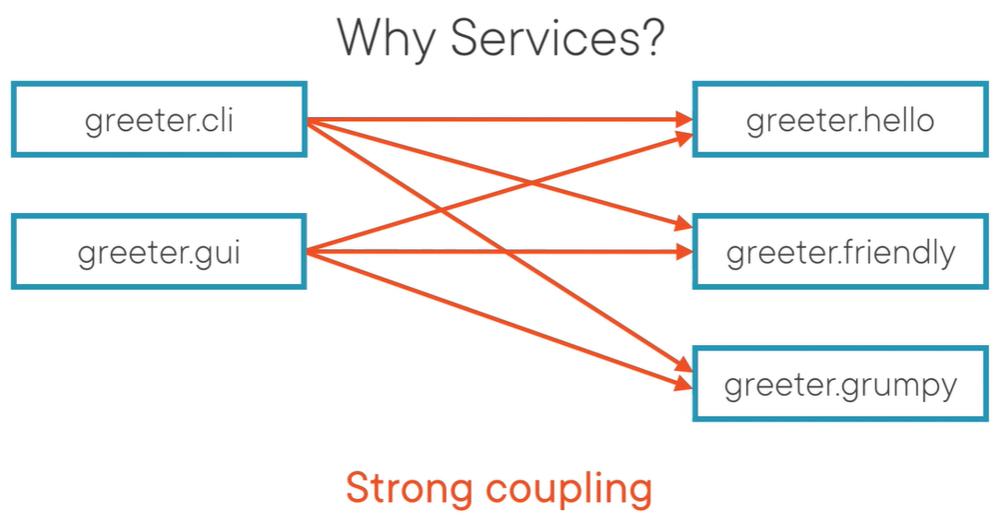
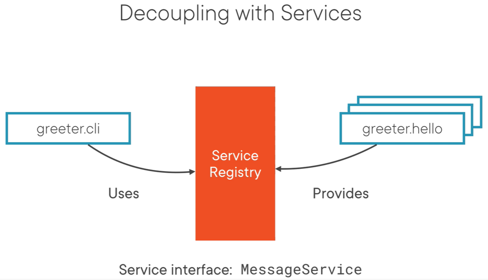
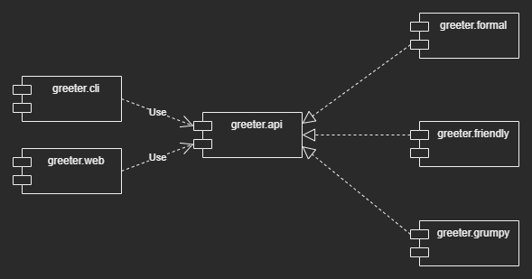

 # Java Module Commands

``` rm -fr target/classes ```

## All Modules in ONE

> NOTE: THERE IS NO COMMA BETWEEN MODULE NAMES

```
javac -d {output-dir} --module-source-path {src-root-dir} -m {module-name-1},{module-name-2},...
```

```
javac -d target/classes --module-source-path src/main/java -m com.yulikexuan.web
```

```
javac -d target/classes --module-source-path src/main/java -m com.yulikexuan.domain
```

> java -p -m === java --module-path --module

```
javac -d target/classes --module-source-path src/main/java -m com.yulikexuan.domain,com.yulikexuan.cli,com.yulikexuan.web
```

```
java -p target/classes -m com.yulikexuan.greeter.cli/ com.yulikexuan.greeter.cli.Main
```

```
jar --create --file=target/domain-1.0.0.jar --module-version=1.0.0 -C target/classes/com.yulikexuan.domain .
```

```
jar --create --file=target/cli-1.0.0.jar --module-version=1.0.0 -C target/classes/com.yulikexuan.cli .
```

```
jar --create --file=target/web-1.0.0.jar --module-version=1.0.0 -C target/classes/com.yulikexuan.web .
```

```
jar --create --file=mod/greeter.api.1.0.0.jar --module-version=1.0.0 -C target/classes/com.yulikexuan.greeter.api .
```


## Single Module

> javac -d {output-dir} {all source files, including module-info.java}

```
    javac -d target/classes src/main/java/module-info.java  \
            src/main/java/com/yulikexuan/domain/greeter/Main.java
```

```
    java -p target/classes -m com.yulikexuan.domain/com.yulikexuan.domain.greeter.Main
```

## List all modules of JDK

``` java --list-modules ```


## Check module declaration

``` java --describe-module java.sql ```


## The Java command Showing Module Resolution
  ```
  java --show-module-resolution -p target/classes -m com.yulikexuan.cli
    root com.yulikexuan.cli file:///C:/TecsysDev/javaguru/projects/pure-java-lab/java-module-lab/application/target/classes/com.yulikexuan.cli/
    com.yulikexuan.cli requires com.yulikexuan.domain file:///C:/TecsysDev/javaguru/projects/pure-java-lab/java-module-lab/application/target/classes/com.yulikexuan.domain/
    com.yulikexuan.domain requires java.logging jrt:/java.logging
    ... ...
  ```  


# OVERVIEW

## Module Declaration Syntax


```
[open] module <module_name> {
    exports <package> [to <module-name>];
    opens <package>;
    requires <module_name>;
}
```

> Put the ``` exports ``` decorations at the top


## Where does this module-info.java live?

- The root of the source tree that comprises the module we're describing
- Completely outside of the package hierarchy
- Other source files inside the module containing classed or interfaces must
  always be part of a package
- You cannot have classes in the default package, that is, without a package
  declaratio at the top inside of a module

> NOTE: By default,  a module strongly encapsulates every package that is inside of it


## Module naming convention

- Separate namespace: One or more Java identifiers separated by '.'
    - Module names live in a completely separate namespace from any other
      identifiers and names in Java
    - This means there will never be a class between clash names and module
      names or package names and module names because these all inhabit their
      own namespace
    - A module name can be a simple, valid Java identifier
    - A module name can cnsist of multiple java identifiers separated by a dot,
      much  like a package name
    - Package names and module names live in completely separate namespace so
      they can overlap if you want to


## Good practices for nameing modules

- Avoid terminal digits in module names
- Root package as module name
    - Choose the module name to be the root package or the longest common prefix
      of all the packages that are inside of the module, for example, ``` com.pluralsight ```


## Compile ``` module-info.java ``` to ``` module-info.class ```

- This means that any information that we define for our module carries over
  from the source code, so the compile time environment, to the runtime
  environment, means that the JVM wil also have knowledge of our module and the
  name of the module and possibly more info that we will define later inside of
  the module declaration   


## Package the compilation output into a JAR file

- You can give the JAR file any namne you want, because in the end what matters
  is the name for the module that we defined inside of the module declaration
- A JAR file that contains a top-level module-info.class is called a modular
  JAR file
- A modular JAR file behaves differently than a regular JAR file


# Selectively Expose Code from a Module

## Dependencies between Modules

- The ``` com.yulikexuan.domain ``` module

    ```
        module com.yulikexuan.domain {
            exports com.yulikexuan.domain.model;
        }
    ```

- ``` exports ``` should be always followed by a package name

- The ``` com.yulikexuan.web ``` module depends on ``` com.yulikexuan.domain ``` module

    ```
        module com.yulikexuan.web {
            requires com.yulikexuan.domain;
        }
    ```

- ``` requires ``` should always be followed by a module name

> Cyclic Dependencies is definitely NOT ALLOWED


# Open modules & packages

## Open package for runtime reflective access

- Reflective Access

    ```
    module com.yulikexuan.domain {
        exports com.yulikexuan.domain.model;
        exports com.yulikexuan.domain.service.api;
        opens com.yulikexuan.domain.service.api.impl;
    }

    ```
    Class.forName("com.yulikexuan.domain.service.api.impl.GreetingServiceImpl").newInstance();
    ```

- Reflective change access level of a field of domain module

    ```
    module com.yulikexuan.domain {
        exports com.yulikexuan.domain.model;
        exports com.yulikexuan.domain.service.api;
        opens com.yulikexuan.domain.model;
        opens com.yulikexuan.domain.service.api.impl;
    }
    ```

    ```
    Class.forName("com.yulikexuan.domain.model.Greeter")
            .getDeclaredField("secret")
            .setAccessible(true);
    ```


## Open Modules for reflection

- Opoen modules can be a useful default when working with frameworks that expect
  unfettered reflective access to encapsulated classes, when using spring
  framework or hibernate

- It's better to have compile time encapsulation only than no encapsulation at all


    ```
    open module com.yulikexuan.domain {
        exports com.yulikexuan.domain.model;
        exports com.yulikexuan.domain.service.api;
    }
    ```

## Qualified Exports

```
open module com.yulikexuan.domain {
    exports com.yulikexuan.domain.model;
    exports com.yulikexuan.domain.service.api to com.yulikexuan.cli;
}
```


# Understanding the Modular JDK

## Why Modularize the JDK

- The JDK has been non-modular for a very long time
    - The whole platform was packaged in a single JAR file called rt.jar where
      rt stands for runtime, now this had a lot of downsides
        - Most notably, the code base of the JDK runtime became more and more
          bloated over time,
        - Dependencies between different parts of the JDK started to arise that
          should not be there
    - There was no notion of true strong encapsulation
        - All the internal implementation classes of the JDK were also just
          there in the rt.jar file and their use was heavily discouraged,
          but it was still possible to get to these internals quite easily,
          which led to a lot of libraries and some applications abusing these
          internal and private APIs, again hampering the evolution of the
          platform
        - Since Java is very strong on backwards compatibility, a lot of these
          private API abusers had to be supported to keep code running
        - This is not a sustainable way to evolve the platform
    - Another issue with the monolithic JDK is that it became an all or nothing
      approach
        - It simply was not possible to tune it to your own needs
        - So even if you were just writing a web application, you still have all
          the desktop APIs there

- The JDK was not in a good place when looking at long-term evolution  

- Modularizing the JDK is a means to address all these issues at once


## Exploring the Modular JDK

- Show you all the modules that are currently part of the JDK
  ```
    java --list-modules

    java.base@15.0.1
    java.compiler@15.0.1
    java.datatransfer@15.0.1
    java.desktop@15.0.1
    java.instrument@15.0.1
    java.logging@15.0.1
    java.management@15.0.1
    java.management.rmi@15.0.1
    java.naming@15.0.1
    java.net.http@15.0.1
    java.prefs@15.0.1
    java.rmi@15.0.1
    java.scripting@15.0.1
    java.se@15.0.1
    java.security.jgss@15.0.1
    java.security.sasl@15.0.1
    java.smartcardio@15.0.1
    java.sql@15.0.1
    ... ...
    jdk.accessibility@15.0.1
    jdk.aot@15.0.1
    jdk.attach@15.0.1
    jdk.charsets@15.0.1
    jdk.compiler@15.0.1
    jdk.crypto.cryptoki@15.0.1
    jdk.crypto.ec@15.0.1
    jdk.crypto.mscapi@15.0.1
    ... ...
  ```




- Two classes of modules
    - The first class of modules starts with ``` java ```
        - All modules that start with ``` java ``` are part of the Java
          specification
        - Every JDK must provide these modules according to the specification
    - The second class of modules starts with ``` jdk ```
        - Modules starting with ``` jdk ``` or different names are still
          important and provide a lot of functionality, but these modules are
          implementation dependent
        - Means that different JDK implementations may have different sets of
          non-Java modules

- Two different ways to require other modules
    - the normal requires declaration
    - requires transitive

- Check module declarations for specific modules in the JDK

  ```
  java --describe-module java.sql
    java.sql@15.0.1
    exports java.sql
    exports javax.sql
    requires java.base mandated
    requires java.xml transitive
    requires java.transaction.xa transitive
    requires java.logging transitive
    uses java.sql.Driver
  ```

    - Every module needs to depend on java.base
    - the ``` java.sql ``` module is using the services mechanism of the JDK


## Depending on Modules

- Add ``` import java.util.logging.Logger; ``` to
  ``` com.yulikexuan.domain.service.api.impl.GreetingServiceImpl ```

- Compile
  ``` javac -d target/classes --module-source-path src/main/java -m com.yulikexuan.domain ```
    - The error message:
      ```
      src\main\java\com.yulikexuan.domain\com\yulikexuan\domain\service\api\impl\GreetingServiceImpl.java:8: error: package java.util.logging is not visible
      import java.util.logging.Logger;
                ^
      (package java.util.logging is declared in module java.logging, but module com.yulikexuan.domain does not read it)
      1 error
      ```

- Fix it in ``` module-info.java ``` of module ``` com.yulikexuan.domain ```

  ```
    open module com.yulikexuan.domain {
        exports com.yulikexuan.domain.model;
        exports com.yulikexuan.domain.service.api to com.yulikexuan.cli;
        requires java.logging;
    }
  ```


## Module Resolution

### How these modules are resolved at runtime by the JVM

- The Java command has gained a new option
  ```
  java --show-module-resolution -p target/classes -m com.yulikexuan.cli
    root com.yulikexuan.cli file:///C:/TecsysDev/javaguru/projects/pure-java-lab/java-module-lab/application/target/classes/com.yulikexuan.cli/
    com.yulikexuan.cli requires com.yulikexuan.domain file:///C:/TecsysDev/javaguru/projects/pure-java-lab/java-module-lab/application/target/classes/com.yulikexuan.domain/
    com.yulikexuan.domain requires java.logging jrt:/java.logging
    ... ...
  ```  

> Each package MUST uniquely belong to a single module


## Requires Transitive



- Why does ``` java.sql ``` depend on ``` java.logging ```?
    - The real answer is that one of the methods of ``` java.sql.Driver ```,  
      ``` getParentLogger ```, returns a ``` java.util.logging.Logger ```,
      and this ``` Logger ``` comes from ``` java.util.logging ```, which is a
      package that belongs to the  ``` java.logging ``` module
    - Means that the usage of ``` java.logging ``` in the ``` java.sql ```
      module is not just an implementation detail, but it's something that is
      exposed through the public API of ``` java.sql ``` because here we're
      returning a ``` Logger ``` type, and this ``` Logger ``` type does not
      belong to the ``` java.sql ``` module
    - The ``` java.sql.Driver ``` interface, which does belong to ``` java.sql ```
      is part of an exported package, and thereby forms the API of the
      ``` java.sql ``` module

- If a module depends on the ``` java.sql ``` module, and call ``` getParentLogger ```
  then this module needs a dependency on ``` java.logging ``` because through
  this ``` java.sql.Driver ``` API that is defined in the ``` java.sql module ```
  we're getting back a return value of a type that is defined in the
  ``` java.logging ``` module

- In essence, the authors of the ``` java.sql ``` module are FORCING this
  dependency on any consumer

- It's not just that this module must be resolved at runtime, but any module
  that requires the ``` java.sql ``` module must also require the ``` java.logging ```
  module in its module declaration to be able to compile against the return type
  of ``` getParentLogger ```

- In the module declaration of ``` java.sql ```, we say requires transitive
  ``` java.logging ```

- Now if we create a module that just requires ``` java.sql ```, then because of
  the requires transitive that is in the module declaration of ``` java.sql ```,
  our defined module will also automatically get a dependency on
  ``` java.logging ```

- A requires transitive dependency, therefore, always indicates a dependency
  that is necessary to support the exported API of the module

- The ``` Logger ``` type is part of the ``` java.sql.Driver ``` interface that
  is defined in ``` java.sql ```, so it has to be a requires transitive
  dependency from ``` java.sql ``` to ``` java.logging ```

- On the other hand, a requires without transitive means that the dependency is
  necessary to support the internal implementation of a module


## Packaging a Module

```
javac -d target/classes --module-source-path src/main/java -m com.yulikexuan.domain,com.yulikexuan.cli,com.yulikexuan.web
```

```
jar --create --file=target/domain-1.0.0.jar --module-version=1.0.0 -C target/classes/com.yulikexuan.domain .
```

```
jar --create --file=target/cli-1.0.0.jar --module-version=1.0.0 -C target/classes/com.yulikexuan.cli .
```

```
jar --create --file=target/web-1.0.0.jar --module-version=1.0.0 -C target/classes/com.yulikexuan.web .
```


- Invoke the jar tool with the ``` --create ``` flag

- Use ``` --file ``` flag to indicate the output location and the name of the
  jar file

- Use ``` -C <DIR> ``` flag followed by the directory that the jar tool will
  change to in order to find the contents
    - the dot ``` . ``` means that all files in the specified directory ``` <DIR> ```

- Use ``` --module-version ``` to specify the version of the jar
    - The Java Platform Module System does not support versioning of Java modules
    - You cannot have multiple versions of a module available on the module path
      when running a Java 9+ application
    - But it's still possible to set a version for a modular JAR file
    - But this is just for convenience because in the end the name of a JAR file
      does not matter at all since the name of the module is determined by the
      module declaration that's inside of the modular JAR file
    - At this point in time, the version of a module is only there for
      informational reasons
    - The version is not used during module resolution
    - And it's also not possible to require a specific version of a module
    - While it's recommended to set a module version for a modular JAR file if a
      version is available, it does not really affect anything


## Inspect modular JAR files

```
jar --describe-module --file=target/domain-1.0.0.jar

com.yulikexuan.domain@1.0.0 jar:file:///C:/TecsysDev/javaguru/projects/pure-java-lab/java-module-lab/application/target/domain-1.0.0.jar/!module-info.class open
exports com.yulikexuan.domain.model
requires java.base mandated
requires java.logging
qualified exports com.yulikexuan.domain.service.api to com.yulikexuan.cli
contains com.yulikexuan.domain.service.api.impl
contains com.yulikexuan.domain.util
```

## Use ``` JMOD ``` to package modules


# Using services in java modules

## Why Services?

- Services offer another way for modules to interact, which will make your
  modular applications even more flexible

- Interestingly, a lot of the machinery behind services was already present in
  the JDK before modules came along, however, services got an overhaul with the
  introduction of the module system, and are now much easier to use

- What is wrong with the interaction between modules using requires
    - There are some downsides when one module requires another module




## Overview





```
jar --create --file=mod/greeter.api.1.0.0.jar --module-version=1.0.0 -C target/classes/com.yulikexuan.greeter.api .
```

```
jar --create --file=mod/greeter.cli.1.0.0.jar --module-version=1.0.0 -C target/classes/com.yulikexuan.greeter.cli .
```

```
jar --create --file=mod/greeter.formal.1.0.0.jar --module-version=1.0.0 -C target/classes/com.yulikexuan.greeter.formal .
```

```
jar --create --file=mod/greeter.friendly.1.0.0.jar --module-version=1.0.0 -C target/classes/com.yulikexuan.greeter.friendly .
```

```
jar --create --file=mod/greeter.grumpy.1.0.0.jar --module-version=1.0.0 -C target/classes/com.yulikexuan.greeter.grumpy .
```

```
java -p target/classes -m com.yulikexuan.greeter.cli/ com.yulikexuan.greeter.cli.Main
```

```
java -p mod;target/classes -m com.yulikexuan.greeter.cli/com.yulikexuan.greeter.cli.Main
```

## Module Declaration Syntax

```
[open] module <module_name> {
    exports <package>;
    opens <package>;
    requires <module_name>;

    uses <package>.<type_name>;

    provides <package>.<type_name> with <package>.<type_name>;
}
```

- The most common way to provide a service is to use ``` interface ``` after
``` provides ```
  - but it could also be an ``` abstract class ``` or even a concrete class

- A module can ``` uses ``` modules and ``` provides ``` implementations in the same time

- Use ``` import ``` in module declarations

```
import com.yulikexuan.greeter.api.MessageService;
module com.yulikexuan.greeter.cli {
    requires com.yulikexuan.greeter.api;
    uses MessageService;
}
```

## Service Instantiation

### Questions about Java Services
- Why the implementation class can be part of an encapsulated package
- How does the services mechanism instantiate these implementations?

- There are essentially two ways in which a service can be instantiated:
    - The service has a public no‑arguments constructor used to instantiate the service
    - Use provider method if there is no default constructor
        - A public static provider method called provider, this method should return an object that implements the ``` MessageService ``` interface
        - The services mechanism will simply call the provider method and take whatever is returned to put it in the service registry
        - By iterating over the ``` ServiceLoader ``` object that was returned,  all discovered services on the module path are instantiated directly, and we could use them right away

      ```
        public class FormalMessageService implements MessageService {
            private final String header;
            private FormalMessageService(String header) {
                this.header = header;
            }
            public static MessageService provider() {
                return new HelloMessageService("From Tecsys");
            }
            // ... ...
        }
      ```


### Lazy Instantiation

- The ``` ServiceLoader ``` API also supports lazy instantiation

  ```
  public final class ServiceLoader<S> extends Object implements Iterable<S>
  ```

- ``` ServiceLoader::stream() ``` returns ``` Stream<ServiceLoader.Provider<S>> ```

- ``` ServiceLoader.Provider::get ``` returns an instance of the provider, for example, ``` GrumpyMessageService ```

- ``` ServiceLoader.Provider::type ``` returns the provider type, for example, an implementation type of ``` MessageService ```, can be
``` FriendlyMessageService ```, etc.

  ```
    ServiceLoader<MessageService> services =
            ServiceLoader.load(MessageService.class);
    services.stream()
            .filter(provider -> { ... })
            .map(ServiceLoader.Provider::get)
            .forEach(messageService -> { ... });
  ```
    - Calling get triggers the instantiation of the service, either through the public no‑arg constructor, as we discussed before, or through the static provider method on the service
    - And then finally, we can start using the service instances

- This mechanism, however, works on the assumption that we can select which service to use based on the implementation class reference


### Service Interface Design

- What can we do to make it easier for consumers to select the right service implementation if there are multiple providers for a given service?
    - The recommended way to do this is that when you expect multiple implementations for a service, then we need to offer consumers enough information through the service interface itself to choose which service implementation is most appropriate for the consumer
    - We may want to expose additional metadata or quality of service attributes through the service interface

- For example:
    - We want to print a message in our example based on the age of the user of the application
    - Extend the ``` MessageService ``` interface with a ``` getTargetAge ``` method
    - The consumer of ``` MessageService ``` implementations can invoke ``` getTargetAge ``` on the various providers before calling ``` getMessage ``` on the appropriate implementation

- Whatever you want to add to your service interface is very domain‑specific and there are no general answers here

> When designing a service interface, don't just think about the functionality is to be exposed, but also think about the information that also should be exposed to potential callers that will help them decide on which service implementation is appropriate in case there are multiple implementations available


## Services and Module resolution

### OVERVIEW

- Explicitly list our service provider modules for compilation
- At runtime, the modules were discovered by the module system (after starting our CLI module without listing them explicitly)

- That's because services are also involved in the module resolution process  

- Theoretically, consumer modules should be able to run without any service providers being present

 - However, in practice, we would like services to be available

 - How the module resolution process works based on our example

 We start the greeter.cli module, making it our root module for resolution. Then the module system sees in the module declaration that it requires greeter.api, so this module, too, will be resolved. However, greeter.api doesn't have any other required dependencies. So with the knowledge that we have so far, this is where the module resolution would stop. However, the module system during resolution also looks at the user's declarations in module infos, and greeter.cli indicates that it uses MessageService. Therefore, the module system will look on the module path to see if there are any modules providing MessageService. And in our case, there are two modules that are provided modules for the MessageService interface, greeter.hello and greeter.friendly. So these two modules also will be resolved. With these two new modules resolved, the module system will now look at the module declarations for greeter.hello and greeter.friendly to see if they have any requires or users declarations that require further module resolution. However, greeter.hello and greeter.friendly only have a required relation with greeter.api, which was already resolved. So there's nothing left for the module resolution process to do. Module resolution is now complete. One thing to keep in mind is that Java.base is always part of the resolved module set, and interestingly, the java.base module info also has a lot of users declarations, indicating that java.base wants to use services from other JDK modules. Therefore, these will be resolved as well during this process, and I'm not showing that here because that will be a very big list. But if you're interested in the details, then run the application with the ‑‑show‑module‑resolution flag, then you will not only see how the service binding triggers module resolution of the greeter.friendly and the greeter.hello modules, but also how java.base binds to a lot of other JDK modules because of the users declarations that it has.
