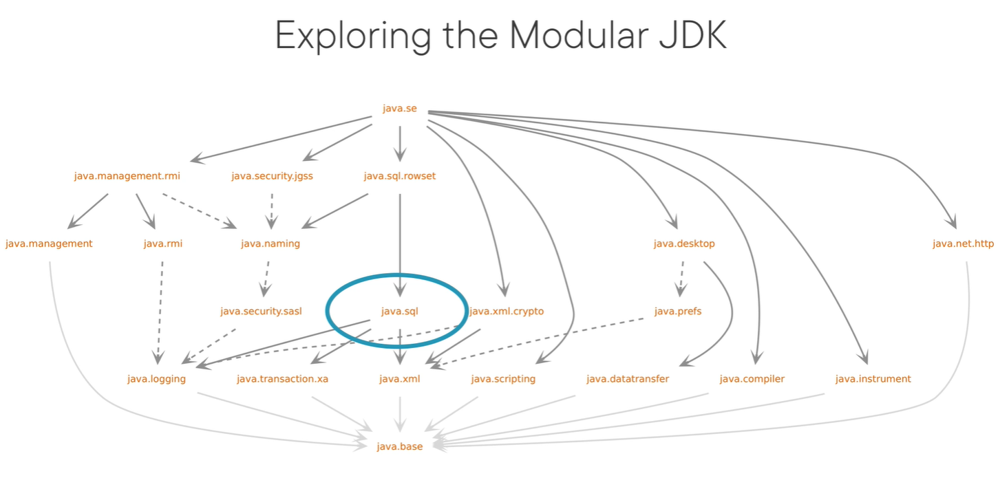

# Java Module Commands

## All Modules in ONE 

> NOTE: THERE IS NO COMMA BETWEEN MODULE NAMES

``` 
javac -d {output-dir} --module-source-path {src-root-dir} -m {module-name-1},{module-name-2},... 
``` 

``` 
javac -d target/classes --module-source-path src/mian/java -m com.yulikexuan.web 
```

``` 
javac -d target/classes --module-source-path src/main/java -m com.yulikexuan.domain
``` 

> java -p -m === java --module-path --module


## Single Module 

> javac -d {output-dir} {all source files, including module-info.java}

``` 
    javac -d target/classes src/main/java/module-info.java  \ 
            src/main/java/com/yulikexuan/domain/greeter/Main.java
```

``` 
    java -p target/classes -m com.yulikexuan.domain/com.yulikexuan.domain.greeter.Main
```


# OVERVIEW

## Module Declaration Syntax


``` 
[open] module <module_name> {
    exports <package> [to <module-name>];
    opens <package>;
    requires <module_name>;
}
```

> Put the ``` exports ``` decorations at the top 


## Where does this module-info.java live?

- The root of the source tree that comprises the module we're describing
- Completely outside of the package hierarchy
- Other source files inside the module containing classed or interfaces must 
  always be part of a package
- You cannot have classes in the default package, that is, without a package 
  declaratio at the top inside of a module

> NOTE: By default,  a module strongly encapsulates every package that is inside of it


## Module naming convention

- Separate namespace: One or more Java identifiers separated by '.'
    - Module names live in a completely separate namespace from any other 
      identifiers and names in Java
    - This means there will never be a class between clash names and module 
      names or package names and module names because these all inhabit their 
      own namespace 
    - A module name can be a simple, valid Java identifier
    - A module name can cnsist of multiple java identifiers separated by a dot, 
      much  like a package name 
    - Package names and module names live in completely separate namespace so 
      they can overlap if you want to 


## Good practices for nameing modules

- Avoid terminal digits in module names
- Root package as module name
    - Choose the module name to be the root package or the longest common prefix 
      of all the packages that are inside of the module, for example, ``` com.pluralsight ```


## Compile ``` module-info.java ``` to ``` module-info.class ```

- This means that any information that we define for our module carries over 
  from the source code, so the compile time environment, to the runtime 
  environment, means that the JVM wil also have knowledge of our module and the 
  name of the module and possibly more info that we will define later inside of 
  the module declaration   


## Package the compilation output into a JAR file 

- You can give the JAR file any namne you want, because in the end what matters 
  is the name for the module that we defined inside of the module declaration 
- A JAR file that contains a top-level module-info.class is called a modular 
  JAR file
- A modular JAR file behaves differently than a regular JAR file


# Selectively Expose Code from a Module

## Dependencies between Modules

- The ``` com.yulikexuan.domain ``` module

    ``` 
        module com.yulikexuan.domain {
            exports com.yulikexuan.domain.model;
        }
    ```

- ``` exports ``` should be always followed by a package name

- The ``` com.yulikexuan.web ``` module depends on ``` com.yulikexuan.domain ``` module

    ``` 
        module com.yulikexuan.web {
            requires com.yulikexuan.domain;
        }
    ```

- ``` requires ``` should always be followed by a module name

> Cyclic Dependencies is definitely NOT ALLOWED


# Open modules & packages

## Open package for runtime reflective access

- Reflective Access

    ``` 
    module com.yulikexuan.domain {
        exports com.yulikexuan.domain.model;
        exports com.yulikexuan.domain.service.api;
        opens com.yulikexuan.domain.service.api.impl;
    }
    
    ``` 
    Class.forName("com.yulikexuan.domain.service.api.impl.GreetingServiceImpl").newInstance();
    ```

- Reflective change access level of a field of domain module

    ``` 
    module com.yulikexuan.domain {
        exports com.yulikexuan.domain.model;
        exports com.yulikexuan.domain.service.api;
        opens com.yulikexuan.domain.model;
        opens com.yulikexuan.domain.service.api.impl;
    }
    ```
    
    ``` 
    Class.forName("com.yulikexuan.domain.model.Greeter")
            .getDeclaredField("secret")
            .setAccessible(true);
    ```


## Open Modules for reflection

- Opoen modules can be a useful default when working with frameworks that expect
  unfettered reflective access to encapsulated classes, when using spring 
  framework or hibernate

- It's better to have compile time encapsulation only than no encapsulation at all


    ``` 
    open module com.yulikexuan.domain {
        exports com.yulikexuan.domain.model;
        exports com.yulikexuan.domain.service.api;
    }
    ```

## Qualified Exports

``` 
open module com.yulikexuan.domain {
    exports com.yulikexuan.domain.model;
    exports com.yulikexuan.domain.service.api to com.yulikexuan.cli;
}
```


# Understanding the Modular JDK

## Why Modularize the JDK

- The JDK has been non-modular for a very long time
    - The whole platform was packaged in a single JAR file called rt.jar where 
      rt stands for runtime, now this had a lot of downsides
        - Most notably, the code base of the JDK runtime became more and more 
          bloated over time, 
        - Dependencies between different parts of the JDK started to arise that 
          should not be there
    - There was no notion of true strong encapsulation
        - All the internal implementation classes of the JDK were also just 
          there in the rt.jar file and their use was heavily discouraged, 
          but it was still possible to get to these internals quite easily, 
          which led to a lot of libraries and some applications abusing these 
          internal and private APIs, again hampering the evolution of the 
          platform 
        - Since Java is very strong on backwards compatibility, a lot of these 
          private API abusers had to be supported to keep code running 
        - This is not a sustainable way to evolve the platform 
    - Another issue with the monolithic JDK is that it became an all or nothing 
      approach 
        - It simply was not possible to tune it to your own needs 
        - So even if you were just writing a web application, you still have all 
          the desktop APIs there

- The JDK was not in a good place when looking at long-term evolution  

- Modularizing the JDK is a means to address all these issues at once 


## Exploring the Modular JDK

- Show you all the modules that are currently part of the JDK 
  ``` 
    java --list-modules
    
    java.base@15.0.1
    java.compiler@15.0.1
    java.datatransfer@15.0.1
    java.desktop@15.0.1
    java.instrument@15.0.1
    java.logging@15.0.1
    java.management@15.0.1
    java.management.rmi@15.0.1
    java.naming@15.0.1
    java.net.http@15.0.1
    java.prefs@15.0.1
    java.rmi@15.0.1
    java.scripting@15.0.1
    java.se@15.0.1
    java.security.jgss@15.0.1
    java.security.sasl@15.0.1
    java.smartcardio@15.0.1
    java.sql@15.0.1
    ... ...
    jdk.accessibility@15.0.1
    jdk.aot@15.0.1
    jdk.attach@15.0.1
    jdk.charsets@15.0.1
    jdk.compiler@15.0.1
    jdk.crypto.cryptoki@15.0.1
    jdk.crypto.ec@15.0.1
    jdk.crypto.mscapi@15.0.1
    ... ...
  ```
  



- Two classes of modules
    - The first class of modules starts with ``` java ```
        - All modules that start with ``` java ``` are part of the Java 
          specification
        - Every JDK must provide these modules according to the specification
    - The second class of modules starts with ``` jdk ```
        - Modules starting with ``` jdk ``` or different names are still 
          important and provide a lot of functionality, but these modules are 
          implementation dependent 
        - Means that different JDK implementations may have different sets of 
          non-Java modules
    
- Two different ways to require other modules
    - the normal requires declaration
    - requires transitive

- Expect module declarations for specific modules in the JDK

  ``` 
  java --describe-module java.sql
    java.sql@15.0.1
    exports java.sql
    exports javax.sql
    requires java.base mandated
    requires java.xml transitive
    requires java.transaction.xa transitive
    requires java.logging transitive
    uses java.sql.Driver
  ```
  
    - Every module needs to depend on java.base
    - the ``` java.sql ``` module is using the services mechanism of the JDK
